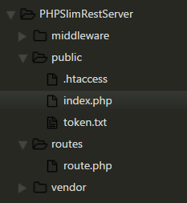
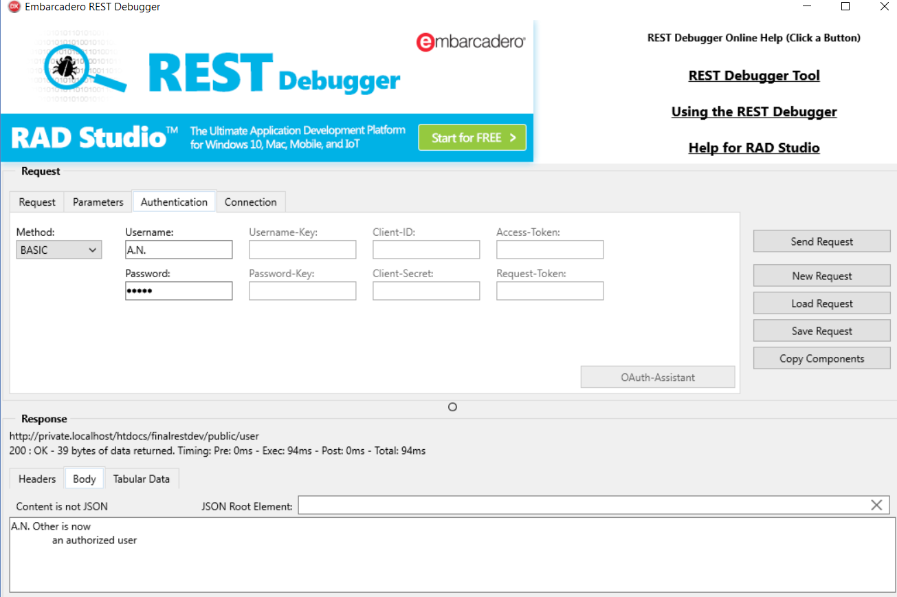
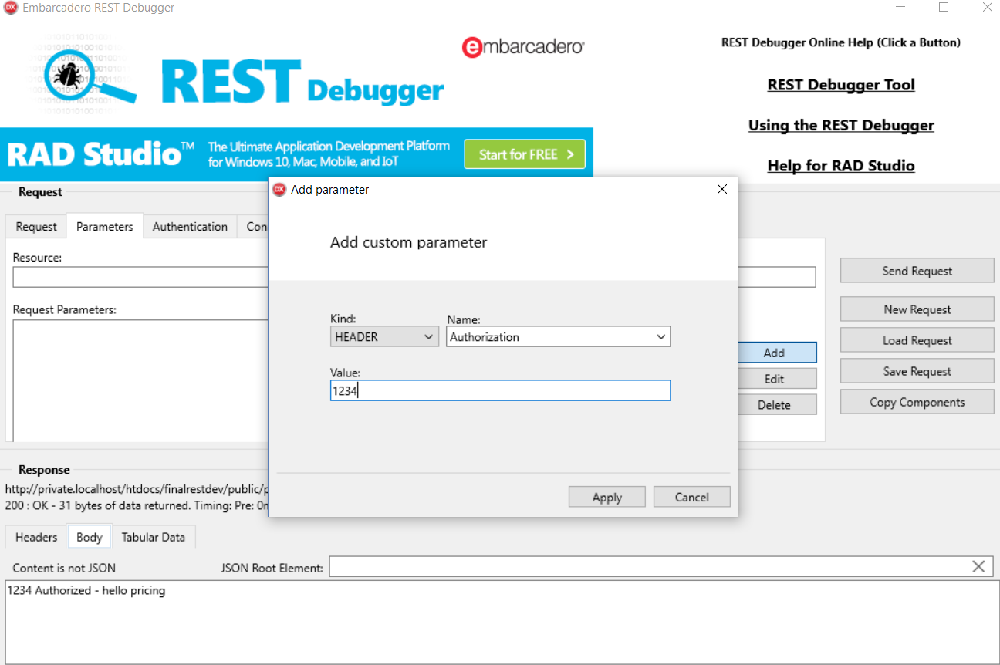
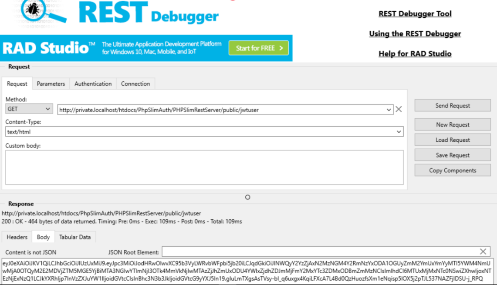
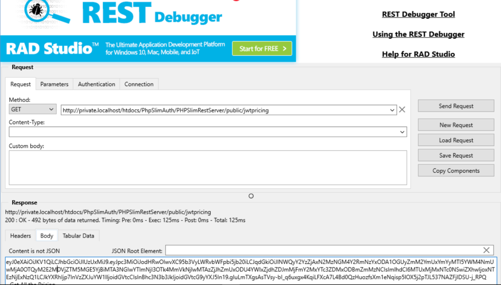
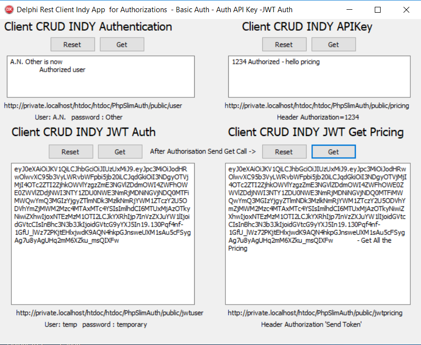
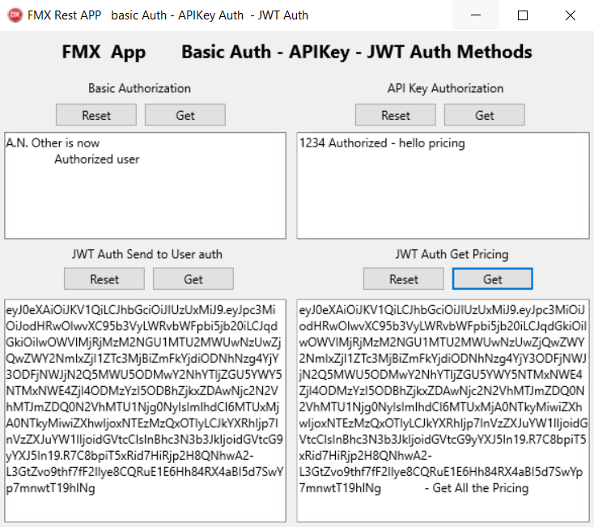

**PHP SLIM Rest Server and DELPHI VCL and FMX REST Client featuring Basic
Authorization, APIKey Authorization and JWT Authorization PART 5**

This is the final part in the REST Series.

**Background**

This features [PHP Slim REST](https://www.slimframework.com/)- Server using
Middleware ‘Multi-Setup’ which includes Basic Authorization, APIKey
Authentication and JWT Authorization ( Json Web Token) all on one REST-Server.

This demonstrates how to set up multiple Authorizations within the Middleware
and how to make Get calls to these types of Authorizations from your Client or
Debugger which are processed within a single Route.

So what does this potentially mean?

Potentially an Application could have Version 1 on Basic Authorisation, Version
2 on APIkey Authorization, Version 3 on JWT Authorization and Version 4 on
OAuth2 all within a single PHP route file and each Middleware Authorization
files stored in the Middleware folder.

This makes coding way easier and effectively simplifies the overhead and allows
for the developer to make progressive changes to his or her security without
disrupting the service. Furthermore one database and a single domain/ sub-domain
could be used for all the different versions of your rest Application.

Two similar Delphi Clients, VCL with Indy-REST components and FMX with REST
components explore the method to make calls to the Multi-Setup PHP REST Server.

**Scope**

**PHP Slim REST Client**

Within the 5 Part Series, the Setup and methodology on how to use Slim has
already been covered.

Here three authorizations need to be implemented within the Middleware with a
single route required.

The idea is to support different authorizations and route connections without
having to create multiple REST-servers.

Authorizations to be covered:-

-   Basic Authentication

-   API Key Authentication

-   JWT Authentication

**VCL REST Client**

Create a REST Client using the Indy Components. Be able to call any one of the
three Authorizations without clashing.

Access the Authorization Header to pass all the Authorization calls through to
ensure a higher level of security.

**FMX REST Client**

Create a REST Client using the REST Components with the use of the 10.1 Berlin /
10.2 Tokyo IDE. Be able to call any one of the three Authorizations without
interference.

Structure the call process to match the VCL Client. Whilst this has been setup
for FMX the code can easily be implemented into a VCL version it must be noted
that the same REST components are available for VCL.

**PHP Slim REST Server**

**Tools required:-**

-   [PHP 5.6](http://www.php.net/) and higher and
    [XAMPP](https://www.apachefriends.org/) or similar

-   [Slim framework](https://www.slimframework.com/).

-   [JWT for PHP](https://jwt.io/).

A Rest Debugger – I make use of the Delphi Rest Debugger.

**PHP SLIM REST Server**

**Structure**

The main changes to the standard implementation of the REST Server set up
earlier in the series, is to create middleware files in the middleware folder.

There will be three middleware files:- BasicAuth.php , APIKeyAuth.php and
JWTAuth.php.

Creating a route file within the Route Folder that will activate the middleware
and allow the response on success within the middleware.

So how can you have different Middleware activated from one route zone i.e.
route.php.

We make use of Slims available invokable class that impliments the
magic__invoke()method…

For each authorization method we call it in the route by using the following
three authorization methods such as calling the Basic Authorization Middleware.

\$basicAuth-\>add(BasicAuth());…

These separate add methods will individually recognise the REST Client call and
direct the requested call to the correct Authorization method in the middleware
folder.

When the individual Authorization is invoked in the middleware, the
Authorization Header is checked before required to process. If successful then
the route will respond with information such as providing a token or simply
allow the route to proceed with the body information that can match the call
that was made by the REST Client.

In reality the Middleware is designed to respond prior to or after the main
Response has been made. In this instance we are using the middleware to
intercept before the main response is made. If not successful then an
appropriate unsuccessful message is sent to you REST Client and the process is
terminated.

As we are settings up three different middleware authorizations, Slim provides a
method to allow for this. In each Authorization files each type of authorization
invokes a function call as below:-

Public function__invoke(\$request,\$response,\$next);

It is within this function that the Authorization \$request is validated.
Essentially the Middleware is used within the route to validate before the body
response.

If valid then we call \$next with a \$response and the route responds to the
call to allow a body response.

At this point if you can follow the layman’s logic which I believe can be
confusing for those who are totally new to REST and Slim then you will be able
to follow the code below:-

**Basic Authorization**

This is the code for the middleware

File basicauth.php

The file uses PHP http PHP\_ AUTH_USER and PHP \_AUTH_PW to capture the correct
header information.

{code}

public function \__invoke(\$request,\$response, \$next)

{

if ((\$request-\>hasHeader('PHP_AUTH_USER')) and

(\$request-\>hasHeader('PHP_AUTH_PW'))){

//converts to a string output

\$headerValueString = \$request-\>getHeaderLine('PHP_AUTH_USER');

\$AuthUser = \$headerValueString;

//sends the name to response

//\$response -\>getBody()-\>write(\$AuthUser. ' ');

//converts to a string output

\$headerValueString = \$request-\>getHeaderLine('PHP_AUTH_PW');

\$AuthPass = \$headerValueString;

//sends the password to response

//\$response -\>getBody()-\>write(\$AuthPass. ' ');

// Do all your user DB checks here

//Sets one username and password for this example

\$username = 'A.N.';

\$password = 'Other';

if (\$AuthUser && \$AuthPass && \$AuthUser === \$username && \$AuthPass ===
\$password) {

// Checks if authorized

\$response -\>getBody()-\>write(\$AuthUser.' '.\$AuthPass. ' is now

Authorized ');

//Authorized - Allows the connected route(GET,PUT,DELETE,POST) to continue...

\$response= \$next(\$request,\$response);

Return \$response;

}else{

//Disallow any transactions from carrying on

\$response -\>getBody()-\>write('UnAuthorized ');

Return \$response;

}

}

}

}

?\>

{/code}

**APIKey Authorization**

This is the code for ApiKey Authorization

File APIkeyauth.php

The header check access the custom header ‘Authorization’. It requests this data
and then checks that the data received is correct.

{code}

public function \__invoke(\$request,\$response, \$next)

{

if (\$request-\>hasHeader('Authorization')) {

\$headerValueString = \$request-\>getHeaderLine('Authorization');

\$AuthKey = \$headerValueString;

//sends the name to response

\$response -\>getBody()-\>write(\$AuthKey. ' ');

\$APIkey = '1234';

if (\$AuthKey === \$APIkey) {

// Test if authorized

\$response -\>getBody()-\>write('Authorized - ');

//Its all good, allows the connected route(GET,PUT,DELETE,POST) to continue...
calls the Route linked to the middleware

\$response= \$next(\$request,\$response);

Return \$response;

}else{

//Disallow any transactions from carrying on and sends the response (error)

\$response -\>getBody()-\>write('UnAuthorized ');

// Set any response to be sent back

Return \$response;

}

}

}

}

?\>

{/code}

**JWT Authorization**

Feel free to read-up on this in the JWT website….

Simply put, it consists of a Header, Payload and a Signature.

The Header consists of the Token and the Hashing Algorithm to use.

It requires generating a permanent or temporary token which represent unique
handshake between multiple web services.  These tokens have to be unique,
securely stored, and must be securely encrypted to prevent the tokens being
rendered useless. Tokens need to be created within the Web Server to allow the
process to continue. So there are a number of ways to generate a Random Token:-

With PHP 7.x the function
[random_bytes](../php.net/manual/en/function.random-bytes.php) can be used as
follows..

\$token = bin2hex(random_bytes(64)); // bin2hex(random_bytes(\$length))

Then to clean the string by the following…

\$token = strtr(\$token,’+/’, ’-_’);

With an output similar to this…

7b42936d915e9b5bf0fe43d692147004f617b494d008e29dbbd41e4528f112db5d999b690714f0b77cfa98318c8231bccbc724f1781125d17d51e52becb9f3

However if you only have version 5.x and lower then you will have to make use of
OpenSSL to generate the string as follows:-

\$token = bin2hex(openssl_random_pseudo_bytes(64));

If you are not comfortable with the security of all this then you can use
random_compat <https://github.com/paragonie/random_compat> as a fallback for
random_bytes() in PHP 5.x. Feel free to investigate.

The downloadable example explained below is set up for PHP 5.x and up. You will
have to replace the token creation code if you are using 7.x.

This is the code for the middleware

Extract from File JWT.php

{code}

public function \__invoke(\$request,\$response, \$next){

\$current_user = 0;

//Set the key

\$AuthUser = '';

\$AuthPass = '';

//first send to authenticate - check if authenticating

// else check if header is 'AUTHORIZATION' then test the sent

if(\$request-\>hasHeader('PHP_AUTH_USER') &&

\$request-\>hasHeader('PHP_AUTH_PW')

){

//converts to a string output

\$headerValueString = \$request-\>getHeaderLine('PHP_AUTH_USER');

\$AuthUser = \$headerValueString;

//converts to a string output

\$headerValueString = \$request-\>getHeaderLine('PHP_AUTH_PW');

\$AuthPass = \$headerValueString;

//Sets one username and password for this example

\$username = 'temp';

\$password = 'temporary';

if (\$AuthUser && \$AuthPass && \$AuthUser === \$username && \$AuthPass ===
\$password ) {

// Checks if authorized then set the user number

\$current_user = 1;

if (count(\$current_user) != 0 ) {

//create a new token

\$createtoken = bin2hex(openssl_random_pseudo_bytes(64));

//clean the token

\$createtoken = strtr(\$createtoken,'+/', '-_');

\$data = [

"iss" =\> "http://your-domain.com",//change

"jti" =\> \$createtoken,

"iat" =\> time(),

// "nbf" =\> time() +10,//add ten sconds

"exp" =\> time() + (3600 \* 24 \* 15),

"data" =\> [

"username" =\> 'temp',//set the id

"password" =\> 'temporary',

]

];

\$secretkey = base64_decode(SECRET_KEY);

try

{

\$jwt = JWT::encode(\$data, \$secretkey,ALGORITHM);

} catch (PDOException \$e) {

echo '{"error":{"text":' . \$e-\>getMessage() . '}}';

}

// \$UnEncoded = ['jwt' =\>\$jwt];

//\$SendToken = json_encode(\$jwt);

\$SendToken = \$jwt;

// save to text file for Demo Purposes however this should be parsed into a
database .... add workings here

file_put_contents("./token.txt",\$SendToken,FILE_USE_INCLUDE_PATH);

\$Newtoken = file_get_contents("./token.txt",FILE_USE_INCLUDE_PATH);

\$response -\>getBody()-\>write(\$Newtoken);

\$response= \$next(\$request,\$response);

Return \$response;

}

}

}else{

//Incorrect Auth Details

\$response -\>getBody()-\>write('UnAuthorized Token');

Return \$response;

}

}

// function to check if Token is real

//returns boolean

public function checktoken(\$AuthToken){

//current user is inactive

\$current_user = 0;

\$decoded = '';

//check if AuthToken exists

if (isset(\$AuthToken)){

//remove json

//Ltrim(\$AuthToken,'{"jwt":"');

//Rtrim(\$AuthToken,'"}');

//first set the user number

\$current_user = 1;

//set the Token

if (count(\$current_user) != 0 ) {

try {

\$ToDecode = file_get_contents("./token.txt",FILE_USE_INCLUDE_PATH);

//remove json

// Ltrim(\$ToDecode,'{"jwt":"');

// Rtrim(\$ToDecode,'"}');

\$secretkey =base64_decode(SECRET_KEY);

\$decoded = JWT::decode(\$ToDecode, \$secretkey, array(ALGORITHM));

} catch (UnexpectedValueException \$e) {

echo \$e-\>getMessage();

}

// decode to array to run extra checks

\$decoded_array = (array) \$decoded;

//add extra php checking process here

// checks if the token matches and that the token is verified

if ((\$AuthToken ===\$ToDecode) && isset(\$decoded)) {

return true;

}

}

}

else {

return false;

}

}

{/code}

**Route Setup**

This is the code for the route

Extract from File route.php

{code}

//add the middleware

//Technically the last added middleware is the first to be executed

//if it were used to run within the script.

//Here we are going to run the middleware for different specific routes.

\$app-\>get('/pricing',function(\$request,\$response,\$args){

//Add all the processes to send the total pricing data

\$response = 'hello pricing';

return \$response;

//this adds the middleware APIKeyauth.php process.

})-\>add(\$keyauth);

\$app-\>get('/user',function(\$request,\$response,\$args){

\$response = 'user';

return \$response;

//this adds the middleware basicAauth.php process.

//adding it at the end of your route gives flexibility to use different
middleware for different routes.

})-\>add(\$auth);

\$app-\>get('/jwtuser',function(\$request,\$response,\$args){

\$GetToken = '';

//send the token and leave this response blank as the token needs to be sent
back

\$response = '';

return \$response;

//this adds the middleware JWTAuth.php process.

})-\>add(\$JWTauth);

// responds with a comment and will only be authorized if the JWT token is
relevent

\$app-\>get('/jwtpricing',function(\$request,\$response,\$args){

//get request string

\$headerValueString = \$request-\>getHeaderLine('Authorization');

\$AuthToken = \$headerValueString;

\$JWTauth = new SlimJWTAuth();

// initializes boolean checktoken function

if (\$JWTauth-\>checktoken(\$AuthToken)){

//resend the Token back to client + a comment add your info here

\$response = \$AuthToken. ' - Get All the Pricing' ;

return \$response;

}else{

\$response = 'Unauthorized';

return \$response;

}

});

{/code}

This REST server example is not set up as a live demo on the blog. You will have
to set up an Xampp installation.

First time to use Xampp ? A quick search in google will reveal all the answers
you will need to set this up.

Only the index.php open in your IDE with Xampp started to access the calls.

Adjust the http call string to match your local installation. Then test this
out.

**Delphi VCL REST Client**

**Required**

-   Delphi VCL XE3 and up (possibly work on older IDE’s)

-   Latest version of Indy library

-   [Super-Object](https://github.com/hgourvest/superobject/) library

**BackGround**

Set up the Rest structure to make three different Get http calls by using the
following Authorizations:-

-   Basic authorization

-   APIKEy Authorization

-   JWT Auth TokenAuthorization

Use the Indy Custom Headers Option to ensure that the data is passed within the
headers.

Be able to randomly send RESTrequests to any one of these Authorizations without
a RESTResponse fail.

**The Project**

Uses the Delphi VCL IDE . Tested XE3 and UP. Only standard objects are used to
populate the Form. The Image below is self- explanatory.

**Setting up the Basic Authorization**

{code}

//Get

procedure Tfmmain.btngetClick(Sender: TObject);

var

http:TIDHttp;

begin

http := TIdHttp.Create(nil);

http.HandleRedirects := true;

http.ReadTimeout := 5000;

http.MaxAuthRetries := 0;

http.HTTPOptions := [hoInProcessAuth];

Http.Request.BasicAuthentication := True;

Http.Request.Username := 'A.N.';

Http.Request.Password := 'Other';

Http.Request.Accept := 'http';

Http.Request.ContentType := 'application/json';

Memo3.Lines.Text :=
http.Get('http://private.localhost/htdoc/PhpSlimAuth/public/user');

http.free;

end;

{/code}

**Setting up the APIKey Authorization**

{code}

procedure Tfmmain.btngetpricingClick(Sender: TObject);

var

http:TIDHttp;

begin

http := TIdHttp.Create(nil);

http.HandleRedirects := true;

http.ReadTimeout := 5000;

http.MaxAuthRetries := 0;

http.HTTPOptions := [hoInProcessAuth];

Http.Request.CustomHeaders.Clear;

// Add the custom Header to use -Authorization and password -1234

Http.Request.CustomHeaders.AddValue('Authorization','1234');

Http.Request.BasicAuthentication := False;

Http.Request.Accept := 'http';

Http.Request.ContentType := 'application/json';

Memo1.Lines.Text :=
http.Get('http://private.localhost/htdoc/PhpSlimAuth/public/pricing');

http.free;

end;

{/code}

**Setting up JWT Authorization**

Note that on the bottom left of the form, a request is made to the REST Server

using basic authorization.

If this matches then the REST server will generate a new token and hash the
response into a base 64 string. It then sends back this string to the REST
Client.

Only now can a Get http request for the dummy pricing information be made from
the bottom right of the form.

This Call includes the Token that was received and adds it into the
Custom-Header.

When Received, the REST server first checks if the token is valid by checking
the token for an untampered token and that the token is still time .

If successful then it will allow the REST server to release the Dummy pricing
information.

This is a far more robust method of upping the security. This Authorization
method of security should be sufficient for most apps.

This application uses the protocols such as Custom Headers to allow for further
OAuth 2 self-development.

Please remember that all data sent or received should be fully encrypted to
ensure privacy. JWTAuth does not provide this. Your data is still being sent as
text.

{code}

//set up a private variable for the token received

private

JWTToken:string;

{ Private declarations }

//Request the Token

procedure Tfmmain.GetJWTbtnClick(Sender: TObject);

var

http:TIDHttp;

begin

JWTToken:= '';

button4.Enabled:=true;

http := TIdHttp.Create(nil);

http.HandleRedirects := true;

http.ReadTimeout := 5000;

http.MaxAuthRetries := 0;

http.HTTPOptions := [hoInProcessAuth];

Http.Request.CustomHeaders.Clear;

Http.Request.BasicAuthentication := true;

Http.Request.Username := 'temp';

Http.Request.Password := 'temporary';

Http.Request.Accept := 'http';

Http.Request.ContentType := 'application/json';

Memo2.Lines.Text :=
http.Get('http://private.localhost/htdoc/PhpSlimAuth/public/jwtuser');

JWTToken:= Memo2.lines.text;

http.free;

end;

//Using the token to Get dummy pricing

procedure Tfmmain.Button4Click(Sender: TObject);

var

http:TIDHttp;

begin

http := TIdHttp.Create(nil);

http.HandleRedirects := true;

http.ReadTimeout := 5000;

http.MaxAuthRetries := 0;

http.HTTPOptions := [hoInProcessAuth];

//Get the memo authorisation from user

// then resend in json format

Http.Request.CustomHeaders.Clear;

if JWTToken\<\> '' then

begin

Http.Request.CustomHeaders.AddValue('Authorization',JWTToken);

Http.Request.BasicAuthentication := False;

Http.Request.Accept := 'http';

Http.Request.ContentType := 'application/json';

Memo4.Lines.Text :=
http.Get('http://private.localhost/htdoc/PhpSlimAuth/public/jwtpricing');

end;

http.free;

end;

{/code}

**Delphi FMX REST Client**

Delphi Version with REST components installed

**Background**

Set up the same Application as the REST Indy VCL Application using the REST
Client components.

**The Application**

This application makes use of one set of components in a data module.

I will release a short blog on how to call the RESTclient components form code
in the future.

**The code for Basic Authorization as follows:-**

{code}

procedure Tfmmain.Button2Click(Sender: TObject);

var

JValue:TJSONValue;

HTTPAuthent:THTTPbasicauthenticator;

begin

//set to defaults;

dm.RESTRequest1.ResetToDefaults;

dm.RESTClient1.ResetToDefaults;

dm.RESTResponse1.ResetToDefaults;

HTTPAuthent:= THTTPbasicauthenticator.Create('A.N.','Other');

dm.RESTclient1.BaseURL:=
'http://private.localhost/htdoc/PhpSlimAuth/public/user';

dm.RESTClient1.Authenticator := HTTPAuthent;

dm.RESTRequest1.Method:= TRestRequestMethod.rmGET;

dm.RESTRequest1.Execute;

//get response message status

if dm.restresponse1.StatusCode \<\> 200 then

begin

memo5.lines.Add(dm.restresponse1.Errormessage);

end

else

begin

Memo5.lines.Add(dm.RESTResponse1.content);

//use if content returned is Json

{jValue:=dm.RESTResponse1.JSONValue;

Memo5.lines.Add(jValue.ToString); }

end;

dm.RESTClient1.Disconnect;

HTTPAuthent.free;

end;

{/code}

**The code for APIKey Authorization as follows:-**

{code}

//API Key

procedure Tfmmain.Button4Click(Sender: TObject);

var

JValue:TJSONValue;

begin

//set to defaults;

dm.RESTRequest1.ResetToDefaults;

dm.RESTClient1.ResetToDefaults;

dm.RESTResponse1.ResetToDefaults;

dm.RESTClient1.Authenticator.Free;

dm.RESTclient1.BaseURL:=
'http://private.localhost/htdoc/PhpSlimAuth/public/pricing';

dm.RESTClient1.ContentType:='text/html';

//set header params

dm.RESTRequest1.Params.AddItem('Authorization','1234',TRestRequestParameterKind.pkHTTPHEADER);

dm.RESTRequest1.Method:= TRestRequestMethod.rmGET;

dm.RESTRequest1.Execute;

//get response message status

if dm.restresponse1.StatusCode \<\> 200 then

begin

memo6.lines.Add(dm.restresponse1.Errormessage);

end

else

begin

Memo6.lines.Add(dm.RESTResponse1.content);

{jValue:=dm.RESTResponse1.JSONValue;

Memo6.lines.Add(jValue.ToString); }

end;

dm.RESTClient1.Disconnect;

end;

{/code}

**The code for JWTAuthorization as follows:-**

{code}

// Use the Private variable JWTToken to receive the token and to be used for all
further JWT Auth Rest Calls.

private

JWTToken:string;

{ Private declarations }

//Send the basic Authorization Request a Token

procedure Tfmmain.Button6Click(Sender: TObject);

var

JValue:TJSONValue;

HTTPAuthent:THTTPbasicauthenticator;

begin

button8.Enabled:= true;

//set to defaults;

dm.RESTRequest1.ResetToDefaults;

dm.RESTClient1.ResetToDefaults;

dm.RESTResponse1.ResetToDefaults;

JWTToken:= '';

HTTPAuthent:= THTTPbasicauthenticator.Create('temp','temporary');

dm.RESTclient1.BaseURL:=
'http://private.localhost/htdoc/PhpSlimAuth/public/jwtuser';

dm.RESTClient1.Authenticator := HTTPAuthent;

dm.RESTRequest1.Method:= TRestRequestMethod.rmGET;

dm.RESTRequest1.Execute;

//get response message status

if dm.restresponse1.StatusCode \<\> 200 then

begin

memo3.lines.Add(dm.restresponse1.Errormessage);

end

else

begin

Memo3.lines.Add(dm.RESTResponse1.content);

// adds the token to Global string variable

JWTToken := dm.RESTResponse1.content;

// Memo3.lines.Add(jValue.ToString);

end;

dm.RESTClient1.Disconnect;

HTTPAuthent.Free;

end;

// On receipt of the Token, this makes a Get call for the Dummy pricing but

// sends the Token in the custom header

procedure Tfmmain.Button8Click(Sender: TObject);

var

JValue:TJSONValue;

begin

//set to defaults;

dm.RESTRequest1.ResetToDefaults;

dm.RESTClient1.ResetToDefaults;

dm.RESTResponse1.ResetToDefaults;

dm.RESTclient1.BaseURL:=
'http://private.localhost/htdoc/PhpSlimAuth/public/jwtpricing';

dm.RESTClient1.ContentType:='text/html';

dm.RESTClient1.Authenticator.Free;

dm.RESTRequest1.Params.AddItem('Authorization',JWTToken,TRestRequestParameterKind.pkHTTPHEADER);

dm.RESTRequest1.Method:= TRestRequestMethod.rmGET;

dm.RESTRequest1.Execute;

//get response message status

if dm.restresponse1.StatusCode \<\> 200 then

begin

memo4.lines.Add(dm.restresponse1.Errormessage);

end

else

begin

{jValue:=dm.RESTResponse1.JSONValue;

Memo4.lines.Add(jValue.ToString); }

Memo4.lines.Add(dm.RESTResponse1.Content);

end;

dm.RESTClient1.Disconnect;

end;

{/code}

Refer to comments on JWT Authorization in the VCL section if you need to
understand how it works…

**Summary**

**PHP REST Server**

Using Slim’s Invokable methods makes for an interesting REST server. Setting
this up was a rewarding experience and it demonstrates the flexibility of the
lightweight Slim REST API. If you are unsure of the REST system and middleware,
then I suggest that you read the Slim documentation.

**Delphi REST Clients**

In the end working with the Indy component library and working with REST
components were much the same. The advantage of using REST is that Open SSL is
built in for Https calls and there are various components for basic
Authorization, OAuth and Oauth2 which should speed up the developer’s code
completion.

I will share a quick blog on calling the REST Client components in code rather
than having one set available in the data-module. This will make it easier for
those setting up Asynchronous HTTP REST Calling and require a small template
library to call in their Android Apps.

**Recent Changes**

**06/08/2018**

* Updated SLim 3 to latest version. 

* Fixed broken link.

* Removed JWA extra line of code (line4)

Happy Coding
